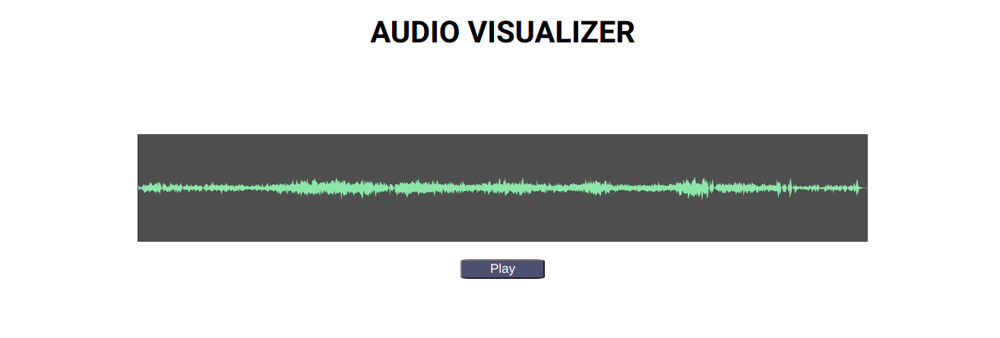

## AUDIO VISUALIZER MVP

Technologies Used

- React
- Typescript
- Wavesurfer.js

### Procedure

- To use the wavesurfer.js library I used useRef hook and created a div element and referenced it.

```js
<div ref={waveRef} />
```

This `<div>` will shows the Waveform generated

- I used useEffect hook to initialize and create the waveform element

```js
useEffect(() => {
  // passing options to create the WaveSurfer
  wavesurfer.current = WaveSurfer.create({
    container: waveRef.current, // reference to the container in which waveform needs to be displayed
    waveColor: "#A8DBA8",
    progressColor: "#3B8686",
  });

  // loads the track from the url
  wavesurfer.current.load(props.track);

  // Removes elements when component unmount
  return () => wavesurfer.current.destroy();
}, [props.track]);
```

Every time the track is changed the useEffect hook is executed and new waveform is generated.

In some cases the types are explicitly passed as "any" because of the difference between the types wavesurfer parameters expect and the type react hooks expect.


