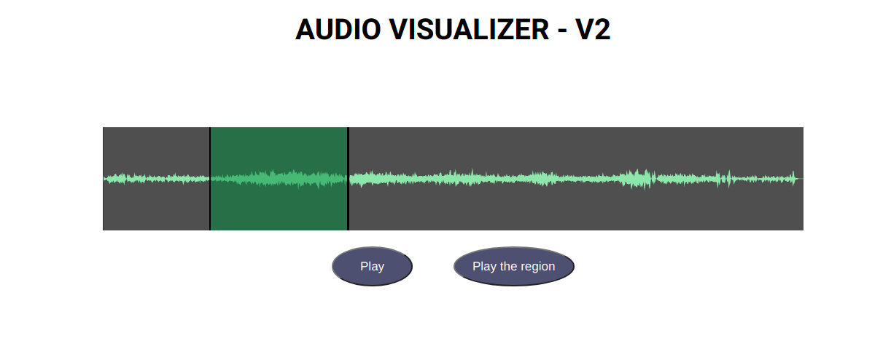

## AUDIO VISUALIZER MVP

Technologies Used

- React
- Javascript
- Wavesurfer.js

### Procedure

- The reason for using Javascript instead of Typescript for this particular task was the ambiguity while importing and adding the plugins from the wavesurfer library.

- To use the wavesurfer.js library I used useRef hook and created a div element and referenced it.

  ```js
  <div ref={waveRef} />
  ```

  This `<div>` will shows the Waveform generated

  For adding the Audio trim feature we imported the Region pluging.

  ```js
  import RegionsPlugin from "wavesurfer.js/dist/plugin/wavesurfer.regions.min.js";
  ```

- Passing the plugin while creating the waveform element
  ```js
  plugins: [
    RegionsPlugin.create({
      regionsMinLength: 2,
      regions: [
        {
          start: 5,
          end: 100,
          loop: false,
          color: "hsla(500, 70%, 30%, 0.5)",
        },
      ],
      dragSelection: {
        slop: 5,
      },
    }),
  ];
  ```
  
